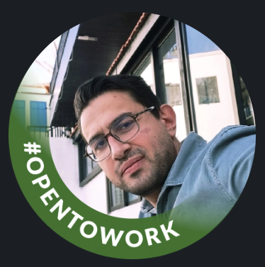

<!-- Banner -->

  

---

# 👋 Hi, I'm Orçun! 🚀  
**Full-Stack SaaS Developer** | Passionate about building scalable web applications and modern SaaS products.

---

## **🚀 About Me**

I'm a developer passionate about **building scalable SaaS platforms** and **modern web applications**.  
Recently, I built **MatchMade**, a **Next.js + Stripe + Firebase** ticketing platform, where I gained hands-on experience in **full-stack SaaS development**.

💡 I’m currently **open to remote roles** and **freelance projects** where I can contribute to:
- Building **modern web apps**
- Integrating **secure payment solutions**
- Developing **end-to-end SaaS products**

---

## **🎟 Featured Project — MatchMade**

**MatchMade** — A **ticketing platform** with real-time Firestore updates, secure Stripe payment integration, and an admin dashboard.

**🔹 Features:**
- **Frontend** → Next.js • React.js • TypeScript • Tailwind CSS v4
- **Backend** → Firebase Auth, Firestore, Hosting
- **Payments** → Stripe Checkout, Webhooks & Payment API
- **CI/CD** → Automated deployment on **Vercel**

🔗 **[Live Demo](https://matchmade-demo.vercel.app)**  
📦 **[Source Code](https://github.com/OrcnTester/matchmade-stripe-firebase-demo)**

---

## **🛠 Tech Stack & Skills**

| **Category**   | **Technologies** |
|---------------|-------------------|
| **Frontend**  | Next.js • React.js • TypeScript • Tailwind CSS |
| **Backend**   | Spring Boot • REST APIs • PDF Automation |
| **Database**  | Firebase • Firestore • PostgreSQL |
| **Payments**  | Stripe Checkout • Webhooks • Payment API |
| **DevOps**    | Vercel • GitHub Actions • CI/CD • Railway • Heroku |
| **Other**     | Docker • JUnit • Maven • iText • PDFBox |

---

## **📌 Current Focus**
- 🔹 Building **scalable SaaS platforms** with Next.js & Firebase  
- 🔹 Creating **secure payment flows** with Stripe  
- 🔹 Designing **REST APIs** & PDF automation for manufacturing  
- 🔹 Preparing for **Toronto’s tech market** & **remote SaaS opportunities**

---

## **📫 Let's Connect!**

- 💼 [**LinkedIn**](www.linkedin.com/in/orcun-yoruk-355b52147)  
- 💻 [**GitHub**](https://github.com/OrcnTester)  
- 📧 **orcnyoruk@gmail.com**

---

## **✨ Fun Side Projects**
- 🎵 **AI Music Generator** → Auto-generates demo tracks using **gTTS + pydub**  
- 📐 **PDF Automation** → Automating order forms & workflows for **Esdoor**  
- 🎮 **RS36S Modding** → Porting indie games & optimizing performance

---
